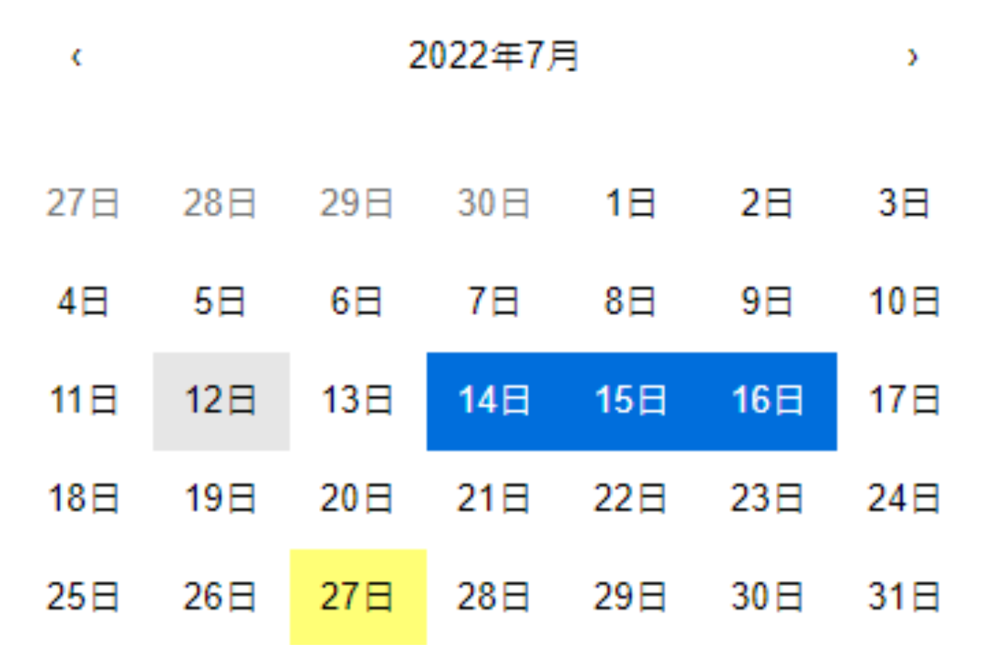

# React Component Overview
## Browser Support:
Chrome / Edge / Firefox

## Deliverable:
1. All HTML/CSS/JS files containing the answers to the questions.
(task 1 or task 2)
2. README.md containing the instruction to build and run the code.

## Evaluation Criteria:
1. Feature completeness.
2. Coding style.
3. Source code structure.
4. Reusability and extensibility.

## Layout

Width: 350px  
Height: 240px  
Font-size: 16px

## Header:
Width: 350px  
Height: 44px  
Margin-bottom: 16px

## Month Select:
Width: 44px  
Height: 44px  
Background-color (default): white  
Background-color (hover): #e6e6e6  

## Day Button:
Width: 50px  
Height: 36px  

## Day State:
Default: white  
Hover: #e6e6e6  
Today: #ffff76  
Active: #006edc  
Non-Current Month: #757575  

## Scenario (Choose one of the following tasks):
### Task – 1 (Date Range Component for current month)
### A:
1. First click date to set it as start date value.
2. Next click date is same as current select option or later than current
option will set it as end date value.
3. Next click date is earlier than current option will reset start date
value.
### B:
1. Show not-allowed icon when hovering on “Non-Current Month” day.
2. Disable day click.
### C:
1. Show current month.
### D:
1. No actions.